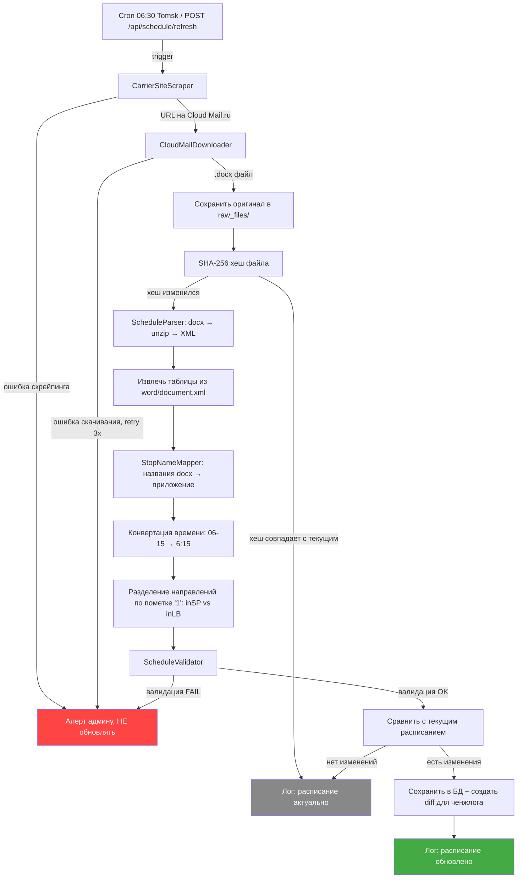

# Фича: Автоматический парсинг расписания

**Ветка:** `02-schedule-parser`
**Создана:** 2026-03-25
**Статус:** не начат

## Контекст

**Зачем:** Главная причина, по которой сайт был заброшен — расписание обновлялось руками. Перевозчик публикует расписание маршрута №112С в виде Word-файла на Cloud Mail.ru. Нужно автоматически скачивать файл, парсить и превращать в формат `ISchedule`, который уже понимает фронтенд.

**Источник данных:**
- **Сайт перевозчика:** `https://xn--80aasi5akda.online/documents` (пассажир-онлайн)
- **Перевозчик:** ООО "ЕТВ", маршрут 112С (Томск — Северный парк)
- **Файл:** `Расписание 112С.docx` — ссылка «Расписание в файле (Word)» в секции 112С
- **Хостинг файла:** Cloud Mail.ru (публичная ссылка, меняется при каждом обновлении)
- Ссылка на Cloud Mail.ru **не стабильная** — перевозчик создаёт новую при обновлении файла. Поэтому парсер сначала скрейпит сайт перевозчика, находит актуальную ссылку, затем скачивает файл
- На сайте перевозчика для 112С кроме Word-файла есть отдельные ссылки на расписание по дням (Будни-день, Будни-вечер, Суббота, Воскресенье) — это изображения, можно использовать как fallback (парсинг через LLM vision)

**Что есть сейчас:** Расписание захардкожено в `frontend/src/shared/common/schedule.ts` как TypeScript-константа `SCHEDULE`. Формат:
```
direction → dayOfWeek → stopName → ["8:15", "10:25", ...]
```
Направления: `inSP`, `out`, `inLB`. Дни: `'0'`–`'6'` (Date.getDay()). Остановки — строки на русском.

## Структура Word-файла

### Общее

Файл содержит **4 таблицы** + текстовые заголовки между ними:

| Таблицы | День недели | Рейсов |
|---------|-------------|--------|
| Table 0 + Table 1 | Будни (пн–пт) | 28 (по 14 в каждой таблице) |
| Table 2 | Суббота | 15 |
| Table 3 | Воскресенье | 12 |

Будни разбиты на две таблицы из-за количества колонок.

### Структура каждой таблицы

Каждая таблица делится на **две половины**, разделённые строкой-заголовком «Остановочный пункт»:

- **Верхняя половина** — направление ИЗ города В Северный парк (маппится на `inSP` / `inLB`)
- **Нижняя половина** — направление ИЗ Северного парка В город (маппится на `out`)

```
Row 0:  Заголовок «Остановочный пункт» | «Кол-во (номер) рейсов»
Row 1:  Подзаголовок (объединённая ячейка)
Row 2:  Номера рейсов: 1, 2, 3¹, 4¹, 5, ...
Row 3+: Остановки с временами
...
Row N:  Заголовок-разделитель «Остановочный пункт» (начало обратного направления)
Row N+1+: Остановки обратного направления
```

### Рейсы через Левобережный

Рейсы с пометкой **«1»** (суперскрипт) идут через мкр. Левобережный Лайф. Это определяет направление:
- Рейс БЕЗ пометки → направление `inSP` (прямой маршрут через Набережную)
- Рейс С пометкой «1» → направление `inLB` (через Левитана → Синее небо → Этюд → Гармония → Три элемента)

У рейсов через Левобережный в ячейках основного маршрута стоит `"-"`, и наоборот.

### Формат времени

Время в файле через **дефис**: `06-15`, `08-30`. В приложении — через двоеточие: `6:15`, `8:30`. Парсер должен конвертировать.

### Объединённые ячейки

Минимально: 3 gridSpan + 3 vMerge на таблицу (только заголовки). Данные не объединены.

### Маппинг остановок (docx → приложение)

Названия в docx **не совпадают** с ключами в `SCHEDULE`. Нужна таблица маппинга:

**Направление в СП (inSP):**

| Docx | Приложение | Расхождение |
|------|-----------|-------------|
| Интернационалистов | Интернационалистов | — |
| пл. Ленина | пл. Ленина | — |
| ТЮЗ | ТЮЗ | — |
| Главпочтамт | Главпочтамт | — |
| Ново-соборная | Новособорная | дефис + регистр |
| ТГУ | ТГУ | — |
| Библиотека ТГУ | Библиотека ТГУ | — |
| ТЭМЗ | ТЭМЗ | — |
| Учебная | Учебная | — |
| Лагерный сад | Лагерный Сад | регистр «с/С» |
| Набережная | Набережная | — |
| ул. В. Маяковского | В. Маяковского | префикс «ул.» |
| Поликлиника | Поликлиника | — |
| ул. М. Цветаевой | Марины Цветаевой (Торта) | другое название |
| Маяк | Маяк | — |
| Серебряный бор | Cеребряный бор | латинская «C» в приложении |

**Направление через Левобережный (inLB) — те же + остановки ЛБ:**

| Docx | Приложение | Расхождение |
|------|-----------|-------------|
| Левобережный, Левитана | Левитана | префикс «Левобережный, » |
| Левобережный, Синее небо | Синее небо | префикс |
| Левобережный, Этюд | Этюд | префикс |
| Левобережный, Гармония | Гармония | префикс |
| Левобережный, Три элемента | Три элемента | префикс |

**Обратное направление (out):**

| Docx | Приложение | Расхождение |
|------|-----------|-------------|
| ул. А. Ахматовой | Анны Ахматовой | другое название |
| Поликлиника (А. Ахматовой) | Поликлиника (Алые Паруса) | другое название |
| Поликлиника (М. Цветаевой) | — | нет в приложении (нужна петля ЛБ) |
| ул. Учебная | Учебная | префикс «ул.» |
| ЦУМ | ЦУМ | — |

**Особенности суббота/воскресенье:** таблицы используют сокращённый набор остановок в прямом направлении (Интернационалистов → пл. Ленина → Лагерный сад, без промежуточных). В обратном — присутствует ЦУМ вместо части городских остановок.

## User Stories

### US-1 — Парсинг Word-файла с расписанием (Приоритет: P1)

Бэкенд скачивает Word-файл с Cloud Mail.ru, извлекает таблицы и превращает в формат `ISchedule`.

**Почему этот приоритет:** Без этого расписание по-прежнему обновляется руками.

**Как проверить независимо:** Скормить парсеру реальный Word-файл → получить JSON в формате `ISchedule` → сравнить с захардкоженным расписанием.

**Сценарии приёмки:**

1. **Дано** Word-файл с расписанием, **Когда** парсер обрабатывает файл, **Тогда** результат — JSON в формате `ISchedule` с корректными направлениями (`inSP`, `inLB`, `out`), днями (`'0'`–`'6'`) и временами (формат `H:MM`)
2. **Дано** в docx рейсы помечены «1», **Когда** парсер обрабатывает файл, **Тогда** помеченные рейсы маппятся на направление `inLB`, остальные — на `inSP`
3. **Дано** названия остановок в docx отличаются от ключей в приложении, **Когда** парсер обрабатывает файл, **Тогда** применяется таблица маппинга и названия нормализуются
4. **Дано** время в формате `06-15`, **Когда** парсер обрабатывает файл, **Тогда** время конвертируется в `6:15`

---

### US-2 — Устойчивость к смене формата (Приоритет: P1)

Парсер работает по гибридной схеме: детерминированный парсинг → валидация → LLM-fallback. Если перевозчик изменит структуру файла или начнёт публиковать скриншот — система продолжит работать.

**Почему этот приоритет:** Если парсер сломается при первом же изменении формата — проект снова будет заброшен.

**Сценарии приёмки:**

1. **Дано** файл в текущем формате, **Когда** парсер обрабатывает файл, **Тогда** используется быстрый детерминированный парсер (без обращения к LLM)
2. **Дано** файл в изменённом формате (другой порядок колонок, другие заголовки), **Когда** детерминированный парсер не прошёл валидацию, **Тогда** текст/изображение отправляется в LLM для парсинга
3. **Дано** вместо .docx опубликован скриншот таблицы (PNG/JPG), **Когда** парсер определяет формат, **Тогда** изображение отправляется в LLM с vision для OCR + структурирования
4. **Дано** LLM-парсинг тоже не прошёл валидацию, **Тогда** расписание НЕ обновляется, отправляется алерт админу

---

### US-3 — Автоматическое обновление по расписанию (Приоритет: P1)

Cron-задача проверяет Cloud Mail.ru раз в день. Если файл изменился — скачивает и парсит заново.

**Почему этот приоритет:** Без автоматического обновления снова придётся обновлять руками.

**Как проверить независимо:** Подождать сутки → проверить что в логах была попытка обновления → если файл не менялся, расписание не перезаписано.

**Сценарии приёмки:**

1. **Дано** cron настроен на ежедневный запуск, **Когда** наступает время, **Тогда** бэкенд скачивает файл с Cloud Mail.ru
2. **Дано** файл изменился (другой хеш), **Когда** cron сработал, **Тогда** новый файл скачан, распаршен, расписание в БД обновлено
3. **Дано** файл не изменился, **Когда** cron сработал, **Тогда** расписание не перезаписывается, в логе — «расписание актуально»

---

### US-4 — Ручной триггер обновления (Приоритет: P1)

Эндпоинт POST `/api/schedule/refresh` запускает парсинг вручную. Защищён паролем/токеном.

**Почему этот приоритет:** Если перевозчик внезапно обновил расписание — не ждать сутки.

**Сценарии приёмки:**

1. **Дано** авторизованный запрос, **Когда** POST `/api/schedule/refresh`, **Тогда** парсинг запускается немедленно, ответ — результат (успех/ошибка + какой метод использован: детерм./LLM)
2. **Дано** неавторизованный запрос, **Когда** POST `/api/schedule/refresh`, **Тогда** ответ 401
3. **Дано** авторизованный запрос с body `{ url: "..." }`, **Когда** POST `/api/schedule/refresh`, **Тогда** парсер скачивает файл по указанному URL (позволяет обновить ссылку)

---

### US-5 — API для фронтенда (Приоритет: P1)

GET `/api/schedule` отдаёт расписание в формате `ISchedule`. Фронтенд загружает расписание из API вместо захардкоженной константы.

**Почему этот приоритет:** Без этого фронтенд не сможет использовать автоматически обновляемое расписание.

**Сценарии приёмки:**

1. **Дано** расписание есть в БД, **Когда** GET `/api/schedule`, **Тогда** ответ 200 с JSON в формате `ISchedule`
2. **Дано** расписание отсутствует в БД, **Когда** GET `/api/schedule`, **Тогда** ответ 200 с fallback на последнее известное расписание

---

### US-6 — Фронтенд: загрузка расписания из API (Приоритет: P1)

Фронтенд при загрузке запрашивает `/api/schedule` и кладёт результат в Redux вместо захардкоженного `SCHEDULE`.

**Почему этот приоритет:** Финальный шаг — связать фронт с бэкендом.

**Как проверить независимо:** Открыть сайт → в DevTools Network видно запрос к `/api/schedule` → расписание отображается корректно.

**Сценарии приёмки:**

1. **Дано** бэкенд доступен, **Когда** пользователь открывает сайт, **Тогда** расписание загружается из API
2. **Дано** бэкенд недоступен, **Когда** пользователь открывает сайт, **Тогда** используется кешированное расписание (service worker / localStorage) или захардкоженный fallback

---

### US-7 — Ченжлог изменений расписания на сайте (Приоритет: P2)

Когда парсер обнаруживает изменение расписания — сохранить diff (что было → что стало). На сайте показать ченжлог: дата обновления + список изменений.

**Почему этот приоритет:** Расписание работает и без ченжлога. Но ченжлог снимает вопросы «а расписание актуальное?».

**Сценарии приёмки:**

1. **Дано** парсер обнаружил изменение расписания, **Когда** обновление сохранено, **Тогда** в БД создаётся запись ченжлога с diff
2. **Дано** есть записи в ченжлоге, **Когда** пользователь открывает сайт, **Тогда** видно «Обновлено: [дата]» и можно посмотреть что изменилось
3. **Дано** расписание не менялось, **Когда** cron отработал, **Тогда** новая запись в ченжлоге не создаётся

---

### US-8 — Мониторинг и алерты пайплайна (Приоритет: P2)

Каждый этап пайплайна парсинга логируется и алертит в Telegram-канал мониторинга при ошибках. Админ всегда видит, что происходит с обновлением расписания.

**Почему этот приоритет:** Без мониторинга парсер может молча сломаться и никто не узнает, что расписание устарело.

**Алерты по этапам:**

| Этап | Успех (лог) | Ошибка (алерт в Telegram) |
|------|------------|--------------------------|
| Скрейпинг сайта перевозчика | «Найдена ссылка: {url}» | «Не удалось найти ссылку на Word-файл 112С на сайте перевозчика» |
| Скачивание с Cloud Mail.ru | «Файл скачан, {size} байт» | «Не удалось скачать файл с Cloud Mail.ru: {причина}» |
| Детерминированный парсинг | «Парсинг OK: {N} остановок, {M} рейсов» | «Детерм. парсинг не прошёл, переключаюсь на LLM» |
| LLM-парсинг | «LLM-парсинг OK» | «LLM-парсинг тоже не прошёл валидацию» |
| Валидация | «Валидация пройдена» | «Валидация не пройдена: {детали}. Расписание НЕ обновлено» |
| Сохранение | «Расписание обновлено, diff: {изменения}» | — |
| Всё ОК, без изменений | «Расписание актуально, файл не изменился» | — |

**Сценарии приёмки:**

1. **Дано** cron сработал, **Когда** любой этап завершился с ошибкой, **Тогда** в Telegram-канал отправляется сообщение с этапом, ошибкой и ссылкой на ручной триггер
2. **Дано** все этапы прошли успешно, **Когда** расписание обновилось, **Тогда** в Telegram отправляется сводка: что изменилось, метод парсинга
3. **Дано** все этапы прошли успешно, **Когда** расписание не изменилось, **Тогда** алерт НЕ отправляется (только запись в лог)

## Ключевые сущности

- **CarrierSiteScraper**: скрейпинг `xn--80aasi5akda.online/documents` для поиска актуальной ссылки на Word-файл 112С
- **CloudMailDownloader**: скачивание файла с Cloud Mail.ru (weblink_get → token → download)
- **ScheduleParser**: детерминированный парсер (XML из docx → ISchedule)
- **ScheduleValidator**: санити-чеки результата перед сохранением
- **StopNameMapper**: таблица маппинга названий остановок docx → приложение
- **schedule (таблица БД)**: распаршенное расписание как JSON + метаданные (дата, хеш, метод парсинга)
- **schedule_raw_files (хранилище)**: оригинальные скачанные файлы для отладки/перепарсинга
- **schedule-seed.json**: начальное расписание для первого запуска (см. «Seed-файл»)
- **ISchedule**: существующий интерфейс фронтенда (`frontend/src/shared/store/schedule/ISchedule.ts`)
- **schedule_changelog (таблица БД)**: записи изменений
- **TelegramAlerter**: отправка алертов и сводок в Telegram-канал мониторинга (Bot API)

## Архитектура парсера

### Пайплайн (Mermaid-диаграмма)



### Пайплайн (текстовое описание)

```
1. Триггер: cron (ежедневно 06:30 Tomsk) или POST /api/schedule/refresh
2. CarrierSiteScraper: GET https://xn--80aasi5akda.online/documents → найти ссылку на Word-файл 112С
3. CloudMailDownloader: скачать файл с Cloud Mail.ru (3 HTTP-запроса: weblink_get → token → download)
4. Сохранить оригинал в raw_files/ для отладки
5. Вычислить SHA-256 хеш файла → если совпадает с текущим → «расписание актуально», СТОП
6. ScheduleParser (детерминированный):
   - docx → unzip → word/document.xml → XML-парсинг таблиц
   - StopNameMapper: маппинг названий остановок
   - Конвертация времени: "06-15" → "6:15"
   - Разделение на направления по пометке "1" (inSP vs inLB)
7. ScheduleValidator: санити-чеки результата
8. Если валидация OK → сохранить в БД, создать diff для ченжлога
9. Если валидация FAIL → НЕ обновлять расписание, алерт админу
```

### Валидация (санити-чеки)

- Есть все 3 направления (`inSP`, `out`, `inLB`)?
- В каждом направлении есть дни `'0'`–`'6'`?
- В каждом дне есть хотя бы 5 остановок?
- Все времена — валидные (`/^\d{1,2}:\d{2}$/`, диапазон 05:00–23:59)?
- Времена идут по возрастанию внутри остановки?
- При обновлении: если >50% рейсов изменилось — подозрительно, требует подтверждения

### Поддерживаемые форматы входных данных (MVP)

| Формат | Метод парсинга | Стоимость |
|--------|---------------|-----------|
| .docx | Детерминированный (XML-парсинг) | Бесплатно |

> **LLM-fallback** (парсинг через нейросеть при изменении формата файла, поддержка PDF/изображений) — **вынесен в отдельную фичу** (см. секцию «LLM-fallback»). В MVP работает только детерминированный парсер для .docx.

## Edge Cases

- **Перевозчик сменил формат файла** → алерт админу, ручное обновление через refresh endpoint (в будущем — LLM-fallback)
- **Перевозчик опубликовал скриншот вместо docx** → алерт админу (в будущем — LLM vision)
- **Word-файл битый или пустой** → не перезаписывать текущее расписание, залогировать ошибку
- **Время в разных форматах** (`06-15`, `6:15`, `06:15`) → нормализовать при парсинге
- **Появилась новая остановка** → добавить в данные, залогировать предупреждение, на фронте подхватится
- **Ссылка на Cloud Mail.ru протухла** → алерт админу, возможность обновить URL через `POST /api/schedule/refresh { url: "..." }`
- **Cloud Mail.ru недоступен** → retry с exponential backoff, при 3 неудачных попытках — алерт
- **Суббота/воскресенье — сокращённый набор остановок** → для отсутствующих остановок (ТЮЗ, Главпочтамт и т.д.) ставить `"-"` или не включать в расписание этого дня
- **Петля через Левобережный на обратном маршруте** → остановки М. Цветаевой / МАЯК появляются дважды в разных контекстах, парсер должен корректно обработать

## Скачивание расписания

### Шаг 1: Найти ссылку на файл (сайт перевозчика)

```
GET https://xn--80aasi5akda.online/documents
→ Парсим HTML, находим секцию «112С маршрут»
→ Извлекаем href из «Расписание в файле (Word) - ссылка»
→ Получаем URL на Cloud Mail.ru (например: https://cloud.mail.ru/public/YJGH/vLzFF48pJ)
```

Сайт пассажир-онлайн может быть SPA — если ссылки не в статическом HTML, нужно найти API, который вызывает фронтенд, или использовать headless browser для этого шага.

### Шаг 2: Скачать файл с Cloud Mail.ru

Публичные ссылки Cloud Mail.ru можно скачивать программно **без авторизации** через 3 HTTP-запроса:

```
1. GET {cloudMailUrl}
   → Парсим HTML, извлекаем "weblink_get" URL (хост CDN-сервера)

2. GET https://cloud.mail.ru/api/v2/tokens/download
   → Получаем временный токен

3. GET {storageUrl}/{filePath}?key={token}
   Referer: {cloudMailUrl}
   → Скачиваем файл
```

Где `filePath` = часть URL после `/public/`.

**Источники:**
- [Bash-скрипт скачивания](https://gist.github.com/vovs03/15a18e0bbe809362e61390580c358910)
- [Node.js wrapper](https://github.com/aratakileo/mailru-cloud-guest-api-wrapper)

### Fallback

Если автоматическое скачивание сломалось (сайт перевозчика изменился или Cloud Mail.ru API поменялся):
- Алерт админу в Telegram
- `POST /api/schedule/refresh` принимает multipart upload (ручная загрузка файла)
- `POST /api/schedule/refresh { url: "..." }` — передать URL напрямую (пропустить шаг 1)

## Seed-файл (schedule-seed.json)

Seed-файл — это JSON-экспорт текущего захардкоженного расписания из `frontend/src/shared/common/schedule.ts`. Располагается в `backend/src/data/schedule-seed.json`.

**Зачем нужен:**

1. **Первый запуск бэкенда** — таблица `schedule` пустая, API должен отдавать расписание. Seed вставляется в БД автоматически с `parse_method='seed'`
2. **Тестовые данные** — используется как фикстура для тестов парсера (сравнение результата парсинга с эталоном)
3. **Аварийный fallback** — если БД повреждена, можно пересоздать из seed'а

**Как создать:** экспортировать объект `SCHEDULE` из фронтенда в JSON. Формат 1:1 совпадает с `ISchedule`:

```json
{
  "inSP": {
    "0": {
      "Интернационалистов": ["8:15", "10:25", "11:55", ...],
      "пл. Ленина": ["8:18", "10:28", ...],
      ...
    },
    "1": { ... },
    ...
  },
  "out": { ... },
  "inLB": { ... }
}
```

**Жизненный цикл:** создаётся один раз перед первым деплоем бэкенда. После этого seed не обновляется — актуальное расписание хранится в БД и обновляется парсером. Seed остаётся как страховка.

---

## Схема БД

Инициализация таблиц добавляется в `backend/src/services/db.ts` → функция `initSchema(db)`, вызывается после `pragma`.

```sql
-- Текущее расписание (одна активная запись в любой момент)
CREATE TABLE IF NOT EXISTS schedule (
  id INTEGER PRIMARY KEY AUTOINCREMENT,
  data TEXT NOT NULL,                          -- JSON формата ISchedule
  file_hash TEXT NOT NULL,                     -- SHA-256 хеш оригинального файла (или 'seed' для начального)
  source_url TEXT,                             -- URL, откуда скачан файл
  parse_method TEXT NOT NULL DEFAULT 'deterministic', -- 'deterministic' | 'seed' | 'manual'
  file_type TEXT NOT NULL DEFAULT 'docx',      -- 'docx' | 'manual'
  stops_count INTEGER NOT NULL,                -- кол-во уникальных остановок
  trips_count INTEGER NOT NULL,                -- кол-во рейсов
  is_active INTEGER NOT NULL DEFAULT 1,        -- 0/1, только одна запись active=1
  created_at TEXT NOT NULL DEFAULT (datetime('now')),
  updated_at TEXT NOT NULL DEFAULT (datetime('now'))
);

CREATE INDEX IF NOT EXISTS idx_schedule_active ON schedule(is_active) WHERE is_active = 1;

-- Лог изменений расписания
CREATE TABLE IF NOT EXISTS schedule_changelog (
  id INTEGER PRIMARY KEY AUTOINCREMENT,
  schedule_id INTEGER NOT NULL REFERENCES schedule(id),
  diff TEXT NOT NULL,                          -- JSON: { added, removed, changed }
  summary TEXT NOT NULL,                       -- Человекочитаемое описание
  parse_method TEXT NOT NULL,
  previous_hash TEXT,
  new_hash TEXT NOT NULL,
  created_at TEXT NOT NULL DEFAULT (datetime('now'))
);

CREATE INDEX IF NOT EXISTS idx_changelog_created ON schedule_changelog(created_at DESC);

-- Лог запусков пайплайна (отладка + защита от параллельных запусков)
CREATE TABLE IF NOT EXISTS schedule_pipeline_runs (
  id INTEGER PRIMARY KEY AUTOINCREMENT,
  trigger TEXT NOT NULL DEFAULT 'cron',        -- 'cron' | 'manual' | 'api'
  status TEXT NOT NULL,                        -- 'running' | 'success' | 'no_changes' | 'error'
  error_message TEXT,
  error_stage TEXT,                            -- 'scrape' | 'download' | 'parse' | 'validate' | 'save'
  parse_method TEXT,
  file_hash TEXT,
  duration_ms INTEGER,
  created_at TEXT NOT NULL DEFAULT (datetime('now'))
);
```

**Решения:**
- `schedule.data` — JSON blob, потому что `ISchedule` глубоко вложенная структура, фронт всегда запрашивает целиком, нормализация не даёт преимуществ
- `is_active` флаг — мгновенный rollback одним `UPDATE` (переключить флаг на предыдущую запись)
- `schedule_pipeline_runs` — отдельная от `changelog` таблица, т.к. запуск может не привести к изменению (файл не менялся, или ошибка)

**Формат `schedule_changelog.diff`:**
```json
{
  "added": [
    { "direction": "inSP", "day": "1", "stop": "Новая остановка", "times": ["8:15"] }
  ],
  "removed": [
    { "direction": "out", "day": "6", "stop": "Старая остановка", "times": ["9:00"] }
  ],
  "changed": [
    {
      "direction": "inSP", "day": "1", "stop": "Интернационалистов",
      "before": ["6:15", "7:15"],
      "after": ["6:15", "7:30"]
    }
  ]
}
```

---

## API-контракты

Файл: `backend/src/routes/schedule.ts` (по паттерну `backend/src/routes/health.ts`).

### GET `/api/schedule`

Без авторизации. Возвращает активное расписание.

**Response 200:**
```json
{
  "schedule": {
    "inSP": { "0": { "Интернационалистов": ["8:15", "10:25"], ... }, ... },
    "out": { ... },
    "inLB": { ... }
  },
  "meta": {
    "updatedAt": "2026-03-25T14:30:00.000Z",
    "parseMethod": "deterministic",
    "fileHash": "a1b2c3..."
  }
}
```

**Заголовки ответа:**
- `Cache-Control: public, max-age=3600` (1 час — расписание меняется максимум раз в день)
- `ETag: "a1b2c3..."` (file_hash для условных запросов)

**Условный запрос:** `If-None-Match: "a1b2c3..."` → **304 Not Modified** (пустое тело).

**Если БД пустая:** вернуть seed из `schedule-seed.json` (автоматически вставляется при первом запуске).

**Response 500:**
```json
{ "error": "internal_error", "message": "Не удалось получить расписание" }
```

---

### POST `/api/schedule/refresh`

Авторизация: `Authorization: Bearer <ADMIN_TOKEN>`.

**Request body (JSON, все поля опциональные):**
```json
{
  "url": "https://cloud.mail.ru/public/XXXX/yyyyyyyy",
  "force": false
}
```
- `url` — прямая ссылка на Cloud Mail.ru (пропускает скрейпинг сайта перевозчика)
- `force` — перепарсить даже если хеш файла совпадает

**Request body (альтернатива — multipart upload):**
```
Content-Type: multipart/form-data
file: <.docx файл>
```

**Response 200 (обновлено):**
```json
{
  "status": "updated",
  "parseMethod": "deterministic",
  "fileHash": "d4e5f6...",
  "stopsCount": 18,
  "tripsCount": 28,
  "changesSummary": "Изменено 3 рейса (будни, inSP)",
  "durationMs": 1250
}
```

**Response 200 (без изменений):**
```json
{ "status": "no_changes", "fileHash": "a1b2c3...", "message": "Расписание актуально" }
```

**Response 401:**
```json
{ "error": "unauthorized", "message": "Неверный или отсутствующий токен" }
```

**Response 422 (валидация не прошла):**
```json
{
  "error": "validation_failed",
  "message": "Парсинг не прошёл валидацию",
  "details": "Отсутствует направление inLB"
}
```

---

### GET `/api/schedule/changelog` [P2]

Без авторизации. Последние изменения расписания.

**Query:** `?limit=10&offset=0` (max limit=50).

**Response 200:**
```json
{
  "items": [
    {
      "id": 5,
      "createdAt": "2026-03-25T14:30:00.000Z",
      "summary": "Изменены 3 рейса (будни, inSP)",
      "parseMethod": "deterministic",
      "diff": { "added": [], "removed": [], "changed": [...] }
    }
  ],
  "total": 5,
  "limit": 10,
  "offset": 0
}
```

---

## Переменные окружения

Обновить `backend/.env.example`:

```env
# === Существующие ===
PORT=3000
NODE_ENV=development

# === Парсер расписания ===

# Токен для POST /api/schedule/refresh (сгенерировать: openssl rand -hex 32)
ADMIN_TOKEN=

# Cron-расписание (формат node-cron: секунды минуты часы день_месяца месяц день_недели)
CRON_SCHEDULE=0 30 6 * * *

# Таймзона для cron (IANA)
CRON_TIMEZONE=Asia/Tomsk

# Путь для хранения оригинальных файлов
RAW_FILES_PATH=./data/raw_files

# Максимум retry при скачивании
DOWNLOAD_MAX_RETRIES=3

# Порог подозрительных изменений (доля изменённых рейсов, 0.0–1.0)
VALIDATION_CHANGE_THRESHOLD=0.5

# === P2: Telegram алерты ===
# TELEGRAM_BOT_TOKEN=
# TELEGRAM_CHAT_ID=

# === Будущее: LLM-fallback (не в MVP) ===
# LLM_PROVIDER=gigachat
# GIGACHAT_API_KEY=
# ANTHROPIC_API_KEY=
# LLM_MODEL=GigaChat-Pro
```

---

## Детали Cron

**Библиотека:** `node-cron` (in-process, работает внутри Express, доступ к БД без отдельного entrypoint).

**Расписание по умолчанию:** 06:30 Asia/Tomsk (UTC+7). Перевозчик в Томске, обновления в рабочее время — проверка в 6:30 ловит вчерашние изменения до утреннего часа пик.

**Конфигурируемо** через `CRON_SCHEDULE` и `CRON_TIMEZONE`.

**Инициализация:** вызывается из `backend/src/index.ts` после `initDb()` и регистрации роутов. Файл: `backend/src/services/schedule/cron.ts`.

**Защита от параллельных запусков (mutex через SQLite):**
- Перед запуском: проверить `schedule_pipeline_runs` на `status='running'` + `created_at > datetime('now', '-10 minutes')`
- Если такая запись есть → пропустить (другой запуск в процессе)
- Если нет → создать запись `status='running'`, по завершению обновить

**Дополнительные триггеры запуска пайплайна:**
- `POST /api/schedule/refresh` (ручной)
- Первый запуск сервера при пустой таблице `schedule` (insert seed)

---

## Интеграция с фронтендом

### RTK Query API

Новый файл `frontend/src/shared/api/scheduleApi.ts` по паттерну `frontend/src/features/Info/model/info.ts` (`infoApi`):

```typescript
export const scheduleApi = createApi({
  reducerPath: 'scheduleApi',
  baseQuery: fetchBaseQuery({ baseUrl: '/api' }),
  endpoints: (builder) => ({
    getSchedule: builder.query<ScheduleResponse, void>({
      query: () => '/schedule',
    }),
  }),
})

export const { useGetScheduleQuery } = scheduleApi
```

Регистрация в `frontend/src/shared/store/app/configureStore.ts`: добавить `scheduleApi.reducer` и `scheduleApi.middleware`.

### Изменения в scheduleSlice

Файл: `frontend/src/shared/store/schedule/scheduleSlice.ts`. Добавить поля:

```typescript
export interface BusStopInfoState {
  schedule: ISchedule
  currentDayKey: number
  nextDayKey: number
  // новые поля:
  scheduleSource: 'hardcoded' | 'api' | 'cache'
  lastUpdatedAt: string | null
  parseMethod: string | null
}
```

Существующий экшн `setSchedule` переиспользуется. Loading/error обрабатываются RTK Query (`useGetScheduleQuery` возвращает `{ data, isLoading, error }`).

### Цепочка fallback

```
1. localStorage (ключ 'severbus:schedule') → если есть и < 24ч → dispatch сразу
2. RTK Query: GET /api/schedule → на успех → dispatch + записать в localStorage
3. Если API недоступен → остаётся то, что загружено на шаге 1
4. Если localStorage пуст → initialState = SCHEDULE (захардкоженная константа)
```

### PWA кэширование

В `frontend/vite.config.ts` → workbox конфиг → добавить runtime caching для `/api/schedule` со стратегией `StaleWhileRevalidate` (показать кэш, обновить в фоне).

---

## LLM-fallback (отдельная фича, не MVP)

> Вынесен из MVP в отдельную итерацию. В MVP при ошибке детерминированного парсера — алерт админу, ручное обновление.

**Идея:** если перевозчик сменит формат файла (другая структура таблиц, PDF, скриншот) — отправить содержимое в LLM для парсинга в формат `ISchedule`.

**Приоритетный провайдер: GigaChat (Сбер)**
- Российский провайдер, серверы в РФ → минимальная латентность
- Поддержка vision (GigaChat-Pro) для парсинга скриншотов
- Альтернативы: Claude (Anthropic), GPT-4o (OpenAI)

**Архитектура (когда будет реализован):**
```
1. Детерминированный парсер → FAIL
2. Извлечь текст из docx/pdf (или изображение)
3. Отправить в LLM с промптом + JSON-schema ISchedule
4. Валидация результата LLM
5. Если OK → сохранить, если FAIL → алерт, не обновлять
```

**Поддерживаемые форматы (после реализации):**

| Формат | Метод | Стоимость |
|--------|-------|-----------|
| .docx | Текст → LLM | ~$0.01–0.05 |
| .pdf | pdf-parse → LLM | ~$0.01–0.05 |
| PNG/JPG | LLM vision | ~$0.01–0.05 |

**Env vars (будущие):** `LLM_PROVIDER`, `GIGACHAT_API_KEY`, `LLM_MODEL`.

---

## План миграции

### Этап 0: Подготовка

1. Экспортировать `SCHEDULE` из `frontend/src/shared/common/schedule.ts` → `backend/src/data/schedule-seed.json`
2. Seed используется как начальные данные для БД и эталон для тестов

### Этап 1: Backend (парсер + API) — без изменений фронтенда

1. Схема БД (CREATE TABLE в `initDb()`)
2. При первом запуске: seed → БД с `parse_method='seed'`
3. GET `/api/schedule` — читает из БД
4. POST `/api/schedule/refresh` — ручной триггер
5. Парсер: scraper → downloader → parser → validator → save
6. Cron

**Фронтенд не трогаем.** Backend деплоится и тестируется независимо. 100% backward compatible.

### Этап 2: Frontend — подключение к API

1. `scheduleApi` (RTK Query)
2. `useSchedule` → вызов API, dispatch `setSchedule`
3. `SCHEDULE` остаётся как `initialState` (мгновенный рендер, нет пустого экрана)
4. Если API недоступен → пользователь видит захардкоженное расписание (как раньше)

**100% backward compatible.** Фронт работает с бэкендом и без.

### Этап 3: localStorage кэширование

1. При успешном ответе API → записать в localStorage
2. При загрузке → сначала читать localStorage → потом запрос к API
3. Цепочка: localStorage → API → hardcoded

### Этап 4: Удаление hardcoded (опционально)

После 2–4 недель стабильной работы парсера. **Рекомендация: оставить навсегда** — ~15KB gzip, ничего не стоит, гарантированный fallback.

### Откат (rollback)

- `POST /api/schedule/refresh` с правильным файлом (multipart upload)
- В БД: `UPDATE schedule SET is_active=0` на плохой записи + `is_active=1` на предыдущей
- Автоматически: фронт fallback на hardcoded если API отдаёт ошибку

---

## Критерии приёмки

### MVP (P1)
- [ ] Seed-файл создан из текущего `SCHEDULE`
- [ ] Схема БД инициализируется при старте
- [ ] При первом запуске seed вставляется в БД
- [ ] Файл скачивается с Cloud Mail.ru
- [ ] Детерминированный парсер извлекает расписание в формат `ISchedule`
- [ ] Названия остановок корректно маппятся (docx → приложение)
- [ ] Рейсы с пометкой «1» маппятся на направление `inLB`
- [ ] Время конвертируется из `06-15` в `6:15`
- [ ] Валидация результата проходит перед сохранением
- [ ] При ошибке парсинга текущее расписание не перезаписывается
- [ ] Оригинальные файлы сохраняются для отладки
- [ ] Cron проверяет обновления раз в день
- [ ] Ручной триггер POST `/api/schedule/refresh` работает
- [ ] GET `/api/schedule` отдаёт расписание с метаданными
- [ ] Фронтенд загружает расписание из API вместо константы
- [ ] Fallback на hardcoded при недоступности API

### P2
- [ ] При обновлении расписания создаётся запись в ченжлоге с diff
- [ ] На сайте видно дату последнего обновления и список изменений
- [ ] Каждый этап пайплайна логируется
- [ ] Ошибки на любом этапе отправляют алерт в Telegram-канал мониторинга
- [ ] Успешное обновление расписания отправляет сводку в Telegram

### Отдельная фича
- [ ] LLM-fallback при ошибке детерминированного парсера (GigaChat)
- [ ] LLM-парсинг изображений (vision)
- [ ] Поддержка PDF

## Задачи

### Backend — парсер
- [ ] `backend/src/services/schedule/carrierScraper.ts` — скрейпинг сайта перевозчика, поиск ссылки на Word-файл
- [ ] `backend/src/services/schedule/cloudMailDownloader.ts` — скачивание файла с Cloud Mail.ru по публичной ссылке
- [ ] `backend/src/services/schedule/parser.ts` — детерминированный парсинг (docx XML → таблицы → ISchedule)
- [ ] `backend/src/services/schedule/stopMapper.ts` — таблица маппинга остановок docx → приложение
- [ ] `backend/src/services/schedule/validator.ts` — санити-чеки результата
- [ ] `backend/src/services/schedule/llmFallback.ts` — LLM-парсинг (текст + vision для изображений)
- [ ] `backend/src/services/schedule/storage.ts` — сохранение оригинальных файлов
- [ ] [P2] `backend/src/services/schedule/logger.ts` — структурированное логирование каждого этапа пайплайна
- [ ] [P2] `backend/src/services/telegram/alerter.ts` — отправка алертов и сводок в Telegram (Bot API)

### Backend — API и cron
- [ ] `backend/src/routes/schedule.ts` — GET `/api/schedule`, POST `/api/schedule/refresh`
- [ ] Cron-задача — ежедневная проверка обновлений
- [ ] Таблица `schedule` в SQLite (JSON blob + metadata + метод парсинга)

### Frontend
- [ ] `src/shared/api/schedule.ts` — fetch `/api/schedule`
- [ ] `src/shared/store/schedule/scheduleSlice.ts` — загрузка из API
- [ ] Fallback: если API недоступен → кешированное расписание или `SCHEDULE` константа
- [ ] [P2] Блок «Обновлено: [дата]» + ченжлог
- [ ] [P2] GET `/api/schedule/changelog`
- [ ] [P3] Улучшение навигации по остановкам (избранные, маршрутная линия, свайп, поиск)
